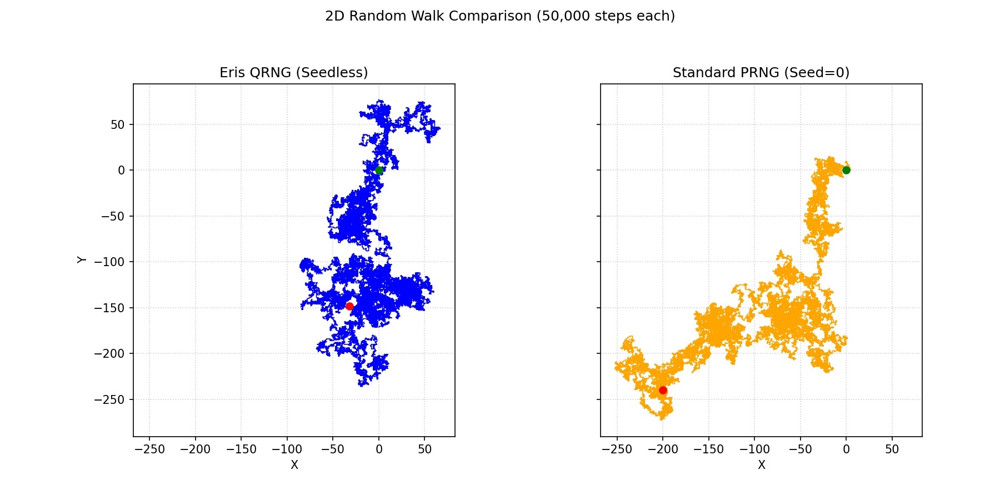

# Quantum Random Data Usage Examples

## 1. Generating Cryptographic Keys (Python)
```python
# Load the quantum random data
with open("quantum_whitened.bin", "rb") as f:
    quantum_data = f.read()

# Example: Extract a 32-byte (256-bit) key
def get_random_key(position, length=32):
    return quantum_data[position:position+length]

# Generate a secure key (use a different position each time)
secure_key = get_random_key(1024)
print(f"Generated key: {secure_key.hex()}")
```

## 2. One-Time Pad Encryption (Python)
```python
def xor_encrypt(message, key):
    return bytes(a ^ b for a, b in zip(message, key))

# Message to encrypt
message = b"SECURE MESSAGE"

# Get a one-time pad from quantum data (must be same length as message)
key = get_random_key(2048, len(message))

# Encrypt
encrypted = xor_encrypt(message, key)
print(f"Encrypted: {encrypted.hex()}")

# Decrypt (receiver must have the same key)
decrypted = xor_encrypt(encrypted, key)
print(f"Decrypted: {decrypted.decode()}")
```

## 3. Generating Random Bitcoin Wallet (Python)
```python
# Requires: pip install bitcoin
from bitcoin import privtopub, pubtoaddr

# Get a position in our quantum data (use a unique position)
position = 3072

# Extract a 32-byte private key
private_key_bytes = get_random_key(position)
private_key = private_key_bytes.hex()

# Generate Bitcoin address
public_key = privtopub(private_key)
address = pubtoaddr(public_key)

print(f"Bitcoin Private Key: {private_key}")
print(f"Bitcoin Address: {address}")
```

## 4. Random Art Generation (HTML/JavaScript)
```html
<!DOCTYPE html>
<html>
<head>
    <title>Quantum Art Generator</title>
    <script>
        // This requires loading the quantum data via FileReader
        let quantumData = null;

        function loadQuantumData() {
            const fileInput = document.getElementById('fileInput');
            const file = fileInput.files[0];
            const reader = new FileReader();

            reader.onload = function(e) {
                quantumData = new Uint8Array(e.target.result);
                document.getElementById('status').textContent = 
                    `Loaded ${quantumData.length} bytes of quantum data`;
            };

            reader.readAsArrayBuffer(file);
        }

        function generateArt() {
            if (!quantumData) {
                alert('Please load quantum data first');
                return;
            }

            const canvas = document.getElementById('artCanvas');
            const ctx = canvas.getContext('2d');
            const position = 5000; // Starting position in quantum data

            // Clear canvas
            ctx.fillStyle = '#000';
            ctx.fillRect(0, 0, canvas.width, canvas.height);

            // Generate art based on quantum data
            for (let i = 0; i < 1000; i++) {
                const x = quantumData[position + i*4] % canvas.width;
                const y = quantumData[position + i*4 + 1] % canvas.height;
                const size = (quantumData[position + i*4 + 2] % 20) + 1;
                const r = quantumData[position + i*4 + 3];
                const g = quantumData[position + i*4 + 4];
                const b = quantumData[position + i*4 + 5];

                ctx.fillStyle = `rgb(${r},${g},${b})`;
                ctx.beginPath();
                ctx.arc(x, y, size, 0, Math.PI * 2);
                ctx.fill();
            }
        }
    </script>
</head>
<body>
    <h1>Quantum Art Generator</h1>
    <p>Load your quantum data file:</p>
    <input type="file" id="fileInput" onChange="loadQuantumData()">
    <p id="status">No quantum data loaded</p>
    <button onClick="generateArt()">Generate Quantum Art</button>
    <canvas id="artCanvas" width="500" height="500"></canvas>
</body>
</html>
```

## 5. Visualizing Randomness: 2D Random Walk

A classic way to visualize the characteristics of a random number source is to plot a 2D random walk. Each step (Up, Down, Left, Right) is determined by pairs of bits from the source.

Ideally, a true random source should produce a walk that explores space erratically without strong directional bias or repeating patterns, resembling a "drunkard's walk". Deterministic Pseudo-Random Number Generators (PRNGs), especially when seeded, can sometimes exhibit subtle patterns or drifts over long sequences.

The script `../visualize_moirai.py` (located one directory up from this example package) was used to generate the following comparison using data from this package (`quantum_whitened.bin`) and Python's standard PRNG (seeded with 0):

****
*Figure: 2D Random Walk Comparison (50,000 steps). Left: Eris QRNG (Seedless). Right: Standard PRNG (Seed=0).* 

**Observations:**

*   **Difference:** The paths taken are distinctly different.
*   **PRNG Drift:** The standard PRNG (orange) shows a clear drift downwards and to the left over this 50,000-step run.
*   **Eris Exploration:** The Eris QRNG walk (blue) appears more centered and explores the space more symmetrically without the same strong directional bias.

This visualization suggests that the Eris data lacks the large-scale directional bias exhibited by this specific seeded PRNG run, hinting at superior randomness characteristics.

**(To regenerate this image, navigate to the `Moirai` directory and run: `python visualize_moirai.py`)**
